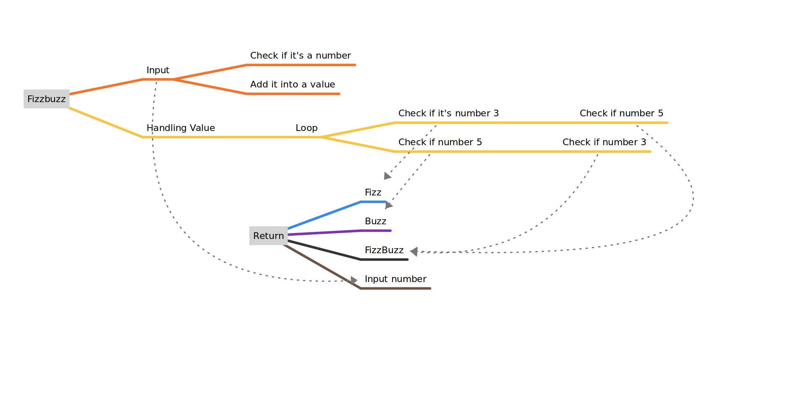

# Day 5

TODAY I AM PISSED. I am honestly so tired of these stupid hoops i have to jump through on linux to get anything done. It's insane how not user friendly alll of this is. They all complain about windows, but atleast windows gets it right. Linux never gets ANYTHING right. There is always stupid .... somewhere that i can't get around or better said there are no reasources for me to get around. Is it fast? Sure. Can i just get the same experience running a stripped version of windows? Yes i can. Without ALL of this stupid hassle. You are wasting peoples time and in turn money because of these nerds developing stuff that the regular public will never touch because they are so chronically online and far removed from public they don't even know UGH. That being said I was trying to setup vscode and get it connected to my account which seems like an impossibility on this OS. KDE Wallet can rot in hell. Same with people making guides for something and linking half of the process to a guide on the distro that leads to another guy to do this. HOW MANY HOOPS MAN. Like a circus animal. I'll just keep using codespaces and save my sanity... Didn't get a lot done today yet but i will update this before i go to sleep.
I did however learn how to do mind mapping  that day.

## PREVIOUS TASKS

1. Do 10 minute meditation before studying. (Still forgot)
2. Keep going!
3. Flexbox zombies chapter 4 and 5 (Was too focused and not enough time)

## TODO

1. Do 10 minute meditation before studying. (Still forgot)
2. Keep going!
3. Flexbox zombies chapter 4 and 5 (Was too focused and not enough time)

## REFLECTION
