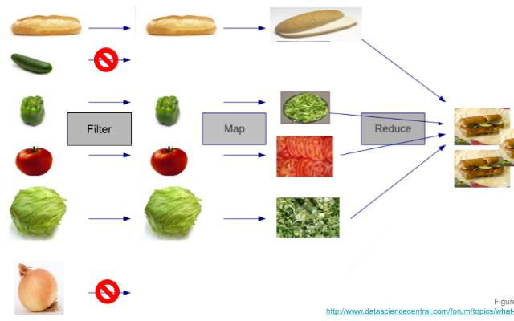

# Day  15 (29.06.2024)

## Array Methods

**map** - automatically iterates over an array and applies the callback function, returns a new array and does not change the original array.  
**filter** - same as **map** returns a new array and does not change the original array, but only IF the callback function returns true  
**reduce** -

1. The callback function takes two arguments instead of one. The first argument is the accumulator, which is the current value of the result at that point in the loop. The first time through, this value will either be set to the initialValue (described in the next bullet point), or the first element in the array if no initialValue is provided. The second argument for the callback is the current value, which is the item currently being iterated on.

2. It also takes in an initialValue as a second argument (after the callback), which helps when we don’t want our initial value to be the first element in the array. For instance, if we wanted to sum all numbers in an array, we could call reduce without an initialValue, but if we wanted to sum all numbers in an array and add 10, we could use 10 as our initialValue.

## PREVIOUS TASKS

1. ~~Get started on the Object basics.~~

## REPEAT TASKS

1. Meditation
2. Flexbox Zombies
3. LeetCode

## TODO

1. Continue or Finish object Basics.

## REFLECTION
